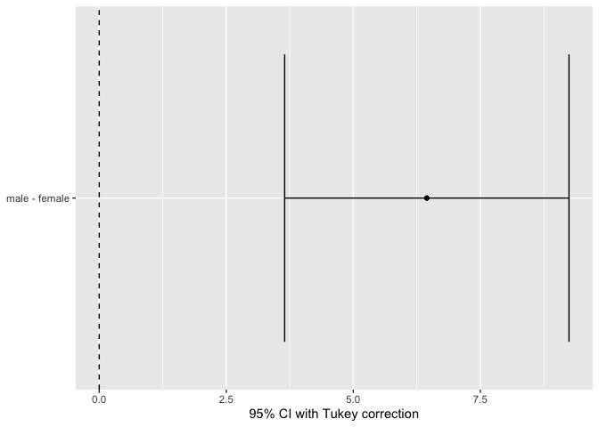

<!-- README.md is generated from README.Rmd. Please edit that file -->

# supernova 

<!-- badges: start -->

[](https://cran.r-project.org/package=supernova)
[](https://github.com/uclatall/supernova/actions)
[](https://app.codecov.io/gh/uclatall/supernova)
<!-- badges: end -->

The goal of `supernova` is to create ANOVA tables in the format used by
Judd, McClelland, and Ryan (2017, ISBN: 978-1138819832) in their
introductory textbook, *Data Analysis: A Model Comparison Approach to
Regression, ANOVA, and Beyond* [(book
website)](http://www.dataanalysisbook.com/index.html).\* These tables
include proportional reduction in error, a useful measure for teaching
the underlying concepts of ANOVA and regression, and formatting to ease
the transition between the book and R.

*\* Note: we are NOT affiliated with the authors or their institution.*

In keeping with the approach in Judd, McClelland, and Ryan (2017), the
ANOVA tables in this package are calculated using a model comparison
approach that should be understandable given a beginner’s understanding
of base R and the information from the book (so if you have these and
don’t understand what is going on in the code, let us know because we
are missing the mark!). Here is an explanation of how the tables are
calculated for fully independent predictor variables
(i.e. between-subjects designs):

1.  The “Total” row is calculated by updating the model passed to an
    empty model. For example, `lm(mpg ~ hp * disp, data = mtcars)` is
    updated to `lm(mpg ~ NULL, data = mtcars)`. From this empty model,
    the sum of squares and df can be calculated.

2.  If there is at least one predictor in the model, the overall model
    row and the error row are calculated. In the vernacular of the book,
    the compact model is represented by the updated empty model from 1
    above, and the augmented model is the original model passed to
    `supernova()`. From these models the SSE(A) is calculated by
    `sum(resid(null_model) ^ 2)`, the SSR is calculated by SSE(C) -
    SSE(A), the PRE for the overall model is extracted from the fit
    (`r.squared`), the df for the error row is extracted from the `lm()`
    fit (`df.residuals`).

3.  If there are more than one predictors, the single term deletions are
    computed using `drop1()`. For the model `y ~ a * b` (which expands
    to `y ~ a + b + a:b`, where `a:b` is the interaction of `a` and
    `b`), `drop1()` essentially creates three models each with one term
    removed: `y ~ a + a:b`, `y ~ b + a:b`, and `y ~ a + b`. These models
    are considered the compact models which do not include the tested
    terms `a`, `b`, and `a:b`, respectively. `drop1()` computes the SSR
    (`Sum Sq`) and SSE(C) (`RSS`) for each of these augmented and
    compact model pairs, and these values are used to compute the SSR
    and PRE for each.

4.  Finally, the `MS` (`SS / df`), `F` (`MSR / MSE`), and `p` columns
    are calculated from already-computed values in the table.

### Supported models

The following models are explicitly tested and supported by
`supernova()`, *for independent samples (between-subjects) data only*.
For these models, there is also support for datasets with missing or
unbalanced data.

-   empty models: `y ~ NULL`
-   simple regression: `y ~ a`
-   multiple regression: `y ~ a + b`
-   interactive regression: `y ~ a * b`

Additionally, a subset of within-subjects designs are supported and
explicitly tested. To accommodate these models `supernova()` can accept
models fit via `lmer()` as in the [Examples](#examples) below. Only
models like those included in those examples have been tested for
within-subjects designs.

Anything not included above is not (yet) explicitly tested and may yield
errors or incorrect statistics. This includes, but is not limited to

-   one-sample *t*-tests

### Other features

In addition to the ANOVA table provided by `supernova()`, the
`supernova` package provides some useful functions for teaching ANOVA
and pairwise comparisons:

**Generate models**: Generate the models that were compared to create
each row of an ANOVA table using `generate_models()`. This can be done
for each of the different SS Types as described in [Using Different SS
Types](#using-different-ss-types) below.

**Pairwise comparisons**: Test each categorical group in a model against
the others using `pairwise()`. This function supports Tukey and
Bonferroni corrections. See the [Pairwise
Comparisons](#pairwise-comparisons) section below.

## Installing

You can install the released version of supernova from
[CRAN](https://CRAN.R-project.org) with:

``` r
install.packages("supernova")
```

Alternatively you can download the package directly from this repository
using `remotes`:

``` r
library(remotes)
install_github("UCLATALL/supernova")
```

## Examples

Here are some basic examples of the code and output for this package:

### Between Subjects Models

#### A model with no predictors (null model)

``` r
supernova(lm(mpg ~ NULL, data = mtcars))
#>  Analysis of Variance Table (Type III SS)
#>  Model: mpg ~ NULL
#> 
#>                                SS  df     MS   F PRE   p
#>  ----- --------------- | -------- --- ------ --- --- ---
#>  Model (error reduced) |      --- ---    --- --- --- ---
#>  Error (from model)    |      --- ---    --- --- --- ---
#>  ----- --------------- | -------- --- ------ --- --- ---
#>  Total (empty model)   | 1126.047  31 36.324
```

#### A regression model with a single predictor

``` r
supernova(lm(mpg ~ hp, data = mtcars))
#>  Analysis of Variance Table (Type III SS)
#>  Model: mpg ~ hp
#> 
#>                                SS df      MS      F    PRE     p
#>  ----- --------------- | -------- -- ------- ------ ------ -----
#>  Model (error reduced) |  678.373  1 678.373 45.460 0.6024 .0000
#>  Error (from model)    |  447.674 30  14.922                    
#>  ----- --------------- | -------- -- ------- ------ ------ -----
#>  Total (empty model)   | 1126.047 31  36.324
```

#### A multiple regression model

``` r
supernova(lm(mpg ~ hp + disp, data = mtcars))
#>  Analysis of Variance Table (Type III SS)
#>  Model: mpg ~ hp + disp
#> 
#>                                SS df      MS      F    PRE     p
#>  ----- --------------- | -------- -- ------- ------ ------ -----
#>  Model (error reduced) |  842.554  2 421.277 43.095 0.7482 .0000
#>     hp                 |   33.665  1  33.665  3.444 0.1061 .0737
#>   disp                 |  164.181  1 164.181 16.795 0.3667 .0003
#>  Error (from model)    |  283.493 29   9.776                    
#>  ----- --------------- | -------- -- ------- ------ ------ -----
#>  Total (empty model)   | 1126.047 31  36.324
```

#### A multiple regression with an interaction

``` r
supernova(lm(mpg ~ hp * disp, data = mtcars))
#>  Analysis of Variance Table (Type III SS)
#>  Model: mpg ~ hp * disp
#> 
#>                                  SS df      MS      F    PRE     p
#>  ------- --------------- | -------- -- ------- ------ ------ -----
#>    Model (error reduced) |  923.189  3 307.730 42.475 0.8198 .0000
#>       hp                 |  113.393  1 113.393 15.651 0.3586 .0005
#>     disp                 |  188.449  1 188.449 26.011 0.4816 .0000
#>  hp:disp                 |   80.635  1  80.635 11.130 0.2844 .0024
#>    Error (from model)    |  202.858 28   7.245                    
#>  ------- --------------- | -------- -- ------- ------ ------ -----
#>    Total (empty model)   | 1126.047 31  36.324
```

#### Turn off the description column

``` r
supernova(lm(mpg ~ hp * disp, data = mtcars), verbose = FALSE)
#>  Analysis of Variance Table (Type III SS)
#>  Model: mpg ~ hp * disp
#> 
#>                  SS df      MS      F    PRE     p
#>  ------- | -------- -- ------- ------ ------ -----
#>  Model   |  923.189  3 307.730 42.475 0.8198 .0000
#>  hp      |  113.393  1 113.393 15.651 0.3586 .0005
#>  disp    |  188.449  1 188.449 26.011 0.4816 .0000
#>  hp:disp |   80.635  1  80.635 11.130 0.2844 .0024
#>  Error   |  202.858 28   7.245                    
#>  ------- | -------- -- ------- ------ ------ -----
#>  Total   | 1126.047 31  36.324
```

### Within Subjects Models

First let’s load up `lme4` which gives us `lmer()`, the function we will
use to fit within-subjects models. Additionally, install and load the
`JMRData` package which has some short datasets with non-independent
observations, and load `dplyr` and `tidyr` so that we can tidy the data.

``` r
# Run this line if you do not have the JMRData package
# remotes::install_github("UCLATALL/JMRData")

library(lme4)
library(tidyr)
library(dplyr)

simple_crossed <- JMRData::ex11.9 %>%
  gather(condition, puzzles_completed, -subject) %>%
  mutate_at(vars(subject, condition), as.factor) 

multiple_crossed <- JMRData::ex11.17 %>%
  gather(condition, recall, -Subject) %>%
  separate(condition, c("type", "time"), -1) %>%
  mutate(across(c(Subject, type, time), as.factor))
```

#### A one-way within-subjects design (crossed)

Fitting the `simple_crossed` data with `lm()` would ignore the
non-independence due to observations coming from the same `subject`.
Compare this output with the following output where the model was fit
with `lmer()` and the specification of `subject` as a random factor:

``` r
simple_crossed %>% 
  lm(puzzles_completed ~ condition, data = .) %>% 
  supernova(verbose = FALSE)
#>  Analysis of Variance Table (Type III SS)
#>  Model: puzzles_completed ~ condition
#> 
#>              SS df    MS     F    PRE     p
#>  ----- | ------ -- ----- ----- ------ -----
#>  Model |  2.250  1 2.250 1.518 0.0978 .2382
#>  Error | 20.750 14 1.482                   
#>  ----- | ------ -- ----- ----- ------ -----
#>  Total | 23.000 15 1.533

# use lmer() to specify the non-independence
simple_crossed %>% 
  lmer(puzzles_completed ~ condition + (1|subject), data = .) %>% 
  supernova()
#>  Analysis of Variance Table (Type III SS)
#>  Model: puzzles_completed ~ condition + (1 | subject)
#> 
#>                               SS df    MS     F    PRE     p
#>  ---------------------- | ------ -- ----- ----- ------ -----
#>  Between Subjects       |                                   
#>  Total                  | 18.000  7 2.571                   
#>  ---------------------- | ------ -- ----- ----- ------ -----
#>  Within Subjects        |                                   
#>    condition            |  2.250  1 2.250 5.727 0.4500 .0479
#>  Error                  |  2.750  7 0.393                   
#>  Total                  |  5.000  8 0.625                   
#>  ---------------------- | ------ -- ----- ----- ------ -----
#>  Total                  | 23.000 15 1.533
```

#### A two-way within-subjects design (crossed)

Here is another example like the previous, but here multiple variables
(`time`, `type`) and their interaction have been specified:

``` r
# fitting this with lm would ignore the non-independence due to Subject
multiple_crossed %>% 
  lm(recall ~ type * time, data = .) %>% 
  supernova(verbose = FALSE)
#>  Analysis of Variance Table (Type III SS)
#>  Model: recall ~ type * time
#> 
#>                   SS df     MS     F    PRE     p
#>  --------- | ------- -- ------ ----- ------ -----
#>  Model     |  85.367  5 17.073 2.791 0.3677 .0400
#>  type      |  12.100  1 12.100 1.978 0.0761 .1724
#>  time      |  44.400  2 22.200 3.629 0.2322 .0420
#>  type:time |   1.867  2  0.933 0.153 0.0126 .8593
#>  Error     | 146.800 24  6.117                   
#>  --------- | ------- -- ------ ----- ------ -----
#>  Total     | 232.167 29  8.006

# using lmer() we can specify the non-independence
multiple_crossed %>% 
  lmer(recall ~ type * time + (1|Subject) + (1|type:Subject) + (1|time:Subject), data = .) %>% 
  supernova()
#>  Analysis of Variance Table (Type III SS)
#>  Model: recall ~ type * time + (1 | Subject) + (1 | type:Subject) + (1 | time:Subject)
#> 
#>                                SS df     MS      F    PRE     p
#>  ---------------------- | ------- -- ------ ------ ------ -----
#>  Between Subjects       |                                      
#>  Total                  | 131.000  4 32.750                    
#>  ---------------------- | ------- -- ------ ------ ------ -----
#>  Within Subjects        |                                      
#>    type                 |  17.633  1 17.633 11.376 0.7399 .0280
#>      Error              |   6.200  4  1.550                    
#>    time                 |  65.867  2 32.933 29.939 0.8821 .0002
#>      Error              |   8.800  8  1.100                    
#>    type:time            |   1.867  2  0.933  9.333 0.7000 .0081
#>      Error              |   0.800  8  0.100                    
#>  Total                  | 101.167 25  4.047                    
#>  ---------------------- | ------- -- ------ ------ ------ -----
#>  Total                  | 232.167 29  8.006
```

#### A one-way between-groups design (nested)

In this example, each person in a group of three generates a rating. If
we fit the data with `lm()` that would ignore the non-independence due
to the people being in the same `group`. Compare this output with the
following output where the `group` is specified as a random factor.

``` r
simple_nested <- JMRData::ex11.1 %>%
  gather(id, value, starts_with("score")) %>%
  mutate(across(c(group, instructions, id), as.factor))

# fitting this with lm would ignore the non-independence due to group
simple_nested %>% 
  lm(value ~ instructions, data = .) %>% 
  supernova(verbose = FALSE)
#>  Analysis of Variance Table (Type III SS)
#>  Model: value ~ instructions
#> 
#>              SS df     MS      F    PRE     p
#>  ----- | ------ -- ------ ------ ------ -----
#>  Model | 12.500  1 12.500 12.500 0.4386 .0027
#>  Error | 16.000 16  1.000                    
#>  ----- | ------ -- ------ ------ ------ -----
#>  Total | 28.500 17  1.676

# using lmer() we can specify the non-independence
simple_nested %>% 
  lmer(value ~ instructions + (1|group), data = .) %>% 
  supernova()
#>  Analysis of Variance Table (Type III SS)
#>  Model: value ~ instructions + (1 | group)
#> 
#>                               SS df     MS     F    PRE     p
#>  ---------------------- | ------ -- ------ ----- ------ -----
#>  Between Subjects       |                                    
#>    instructions         | 12.500  1 12.500 4.687 0.5396 .0963
#>  Error                  | 10.667  4  2.667                   
#>  Total                  | 23.167  5  4.633                   
#>  ---------------------- | ------ -- ------ ----- ------ -----
#>  Within Subjects        |                                    
#>  Total                  |  5.333 12  0.444                   
#>  ---------------------- | ------ -- ------ ----- ------ -----
#>  Total                  | 28.500 17  1.676
```

#### A three-way design with two between-groups variables and a nested variable

In this example, each person in heterosexual marriage generates a rating
of satisfaction. Additionally, these couples were chosen such that they
either have children or not, and have been married 15 vs. 30 years. If
we fit the data with `lm()` that would ignore the non-independence due
to the people being in the same `couple`. Compare this output with the
following output where the `group` is specified as a random factor.

``` r
complex_nested <- JMRData::ex11.22 %>%
  gather(sex, rating, Male, Female) %>%
  mutate(across(c(couple, children, sex, yearsmarried), as.factor))

# fitting this with lm would ignore the non-independence due to group
complex_nested %>% 
  lm(rating ~ sex * yearsmarried * children, data = .) %>% 
  supernova(verbose = FALSE)
#>  Analysis of Variance Table (Type III SS)
#>  Model: rating ~ sex * yearsmarried * children
#> 
#>                                  SS df    MS      F    PRE     p
#>  ------------------------- | ------ -- ----- ------ ------ -----
#>  Model                     | 26.500  7 3.786  5.345 0.6092 .0009
#>  sex                       |  0.000  1 0.000  0.000 0.0000 .0000
#>  yearsmarried              |  1.125  1 1.125  1.588 0.0621 .2197
#>  children                  |  2.000  1 2.000  2.824 0.1053 .1059
#>  sex:yearsmarried          |  2.250  1 2.250  3.176 0.1169 .0874
#>  sex:children              |  0.062  1 0.062  0.088 0.0037 .7690
#>  yearsmarried:children     |  7.563  1 7.563 10.676 0.3079 .0033
#>  sex:yearsmarried:children |  0.500  1 0.500  0.706 0.0286 .4091
#>  Error                     | 17.000 24 0.708                    
#>  ------------------------- | ------ -- ----- ------ ------ -----
#>  Total                     | 43.500 31 1.403

# using lmer() we can specify the non-independence
complex_nested %>% 
  lmer(rating ~ sex * yearsmarried * children + (1|couple), data = .) %>% 
  supernova()
#>  Analysis of Variance Table (Type III SS)
#>  Model: rating ~ sex * yearsmarried * children + (1 | couple)
#> 
#>                                    SS df     MS     F    PRE     p
#>  --------------------------- | ------ -- ------ ----- ------ -----
#>  Between Subjects            |                                    
#>    yearsmarried              | 10.125  1 10.125 9.529 0.4426 .0094
#>    children                  |  0.500  1  0.500 0.471 0.0377 .5058
#>    yearsmarried:children     | 10.125  1 10.125 9.529 0.4426 .0094
#>  Error                       | 12.750 12  1.063                   
#>  Total                       | 33.500 15  2.233                   
#>  --------------------------- | ------ -- ------ ----- ------ -----
#>  Within Subjects             |                                    
#>    sex                       |  3.125  1  3.125 8.824 0.4237 .0117
#>    sex:yearsmarried          |  2.000  1  2.000 5.647 0.3200 .0350
#>    sex:children              |  0.125  1  0.125 0.353 0.0286 .5635
#>    sex:yearsmarried:children |  0.500  1  0.500 1.412 0.1053 .2577
#>  Error                       |  4.250 12  0.354                   
#>  Total                       | 10.000 16  0.625                   
#>  --------------------------- | ------ -- ------ ----- ------ -----
#>  Total                       | 43.500 31  1.403
```

### Using Different SS Types

#### Type III: Orthogonal (default)

``` r
supernova(lm(mpg ~ hp * disp, data = mtcars))
#>  Analysis of Variance Table (Type III SS)
#>  Model: mpg ~ hp * disp
#> 
#>                                  SS df      MS      F    PRE     p
#>  ------- --------------- | -------- -- ------- ------ ------ -----
#>    Model (error reduced) |  923.189  3 307.730 42.475 0.8198 .0000
#>       hp                 |  113.393  1 113.393 15.651 0.3586 .0005
#>     disp                 |  188.449  1 188.449 26.011 0.4816 .0000
#>  hp:disp                 |   80.635  1  80.635 11.130 0.2844 .0024
#>    Error (from model)    |  202.858 28   7.245                    
#>  ------- --------------- | -------- -- ------- ------ ------ -----
#>    Total (empty model)   | 1126.047 31  36.324
```

These are equivalent to the above:

``` r
supernova(lm(mpg ~ hp * disp, data = mtcars), type = 3)
supernova(lm(mpg ~ hp * disp, data = mtcars), type = "III")
supernova(lm(mpg ~ hp * disp, data = mtcars), type = "orthogonal")
```

#### Type I: Sequential

``` r
supernova(lm(mpg ~ hp * disp, data = mtcars), type = 1)
#>  Analysis of Variance Table (Type I SS)
#>  Model: mpg ~ hp * disp
#> 
#>                                  SS df      MS      F    PRE     p
#>  ------- --------------- | -------- -- ------- ------ ------ -----
#>    Model (error reduced) |  923.189  3 307.730 42.475 0.8198 .0000
#>       hp                 |  678.373  1 678.373 93.634 0.7698 .0000
#>     disp                 |  164.181  1 164.181 22.661 0.4473 .0001
#>  hp:disp                 |   80.635  1  80.635 11.130 0.2844 .0024
#>    Error (from model)    |  202.858 28   7.245                    
#>  ------- --------------- | -------- -- ------- ------ ------ -----
#>    Total (empty model)   | 1126.047 31  36.324
```

These are equivalent to the above:

``` r
supernova(lm(mpg ~ hp * disp, data = mtcars), type = "I")
supernova(lm(mpg ~ hp * disp, data = mtcars), type = "sequential")
```

#### Type II: Hierarchical

``` r
supernova(lm(mpg ~ hp * disp, data = mtcars), type = 2)
#>  Analysis of Variance Table (Type II SS)
#>  Model: mpg ~ hp * disp
#> 
#>                                  SS df      MS      F    PRE     p
#>  ------- --------------- | -------- -- ------- ------ ------ -----
#>    Model (error reduced) |  923.189  3 307.730 42.475 0.8198 .0000
#>       hp                 |   33.665  1  33.665  4.647 0.1423 .0399
#>     disp                 |  164.181  1 164.181 22.661 0.4473 .0001
#>  hp:disp                 |   80.635  1  80.635 11.130 0.2844 .0024
#>    Error (from model)    |  202.858 28   7.245                    
#>  ------- --------------- | -------- -- ------- ------ ------ -----
#>    Total (empty model)   | 1126.047 31  36.324
```

These are equivalent to the above:

``` r
supernova(lm(mpg ~ hp * disp, data = mtcars), type = "II")
supernova(lm(mpg ~ hp * disp, data = mtcars), type = "hierarchical")
```

### Displaying which models were compared

This package is based on a model comparison approach to understanding
regression and ANOVA. As such it is useful to know which models are
being compared for any given term in an ANOVA table. The
`generate_models()` function accepts a linear model and the desired type
of SS and returns a list of the models that should be compared to
appropriately evaluate each term in the full model.

``` r
generate_models(lm(mpg ~ hp * disp, data = mtcars), type = 2)
#> 
#> ── Comparison Models for Type III SS ───────────────────────────────────────────
#> 
#> ── Full Model
#> complex: mpg ~ hp + disp + hp:disp
#> simple:  mpg ~ NULL
#> 
#> ── hp
#> complex: mpg ~ hp + disp + hp:disp
#> simple:  mpg ~      disp + hp:disp
#> 
#> ── disp
#> complex: mpg ~ hp + disp + hp:disp
#> simple:  mpg ~ hp +        hp:disp
#> 
#> ── hp:disp
#> complex: mpg ~ hp + disp + hp:disp
#> simple:  mpg ~ hp + disp
```

### Pairwise Comparisons

The `pairwise()` function takes a linear model and performs the
requested pairwise comparisons on the categorical terms in the model.
For simple one-way models where a single categorical variable predicts
and outcome. You will get output similar to other methods of computing
pairwise comparisons (e.g. `TukeyHSD` or `t.test`). Essentially, the
differences on the outcome between each of the groups defined by the
categorical variable are compared with the requested test, and their
confidence intervals and p-values are adjusted by the requested
correction.

However, when more than two variables are entered into the model, the
outcome will diverge somewhat from other methods of computing pairwise
comparisons. For traditional pairwise tests you need to estimate an
error term, usually by pooling the standard deviation of the groups
being compared. This means that when you have other predictors in the
model, their presence is ignored when running these tests. For the
functions in this package, we instead compute the pooled standard error
by using the mean squared error (MSE) from the full model fit.

Let’s take a concrete example to explain that. If we are predicting
`Thumb` length from `Sex`, we can create that linear model and get the
pairwise comparisons like this:

``` r
pairwise(lm(Thumb ~ Sex, data = supernova::Fingers))
#> 
#> ── Tukey's Honestly Significant Differences ────────────────────────────────────
#> Model: Thumb ~ Sex
#> Sex
#> Levels: 2
#> Family-wise error-rate: 0.05
#> 
#>   group_1 group_2  diff pooled_se     q    df lower upper p_adj
#>   <chr>   <chr>   <dbl>     <dbl> <dbl> <int> <dbl> <dbl> <dbl>
#> 1 male    female  6.447     1.029 6.262   155 3.571 9.323 .0000
```

The output of this code will have one table showing the comparison of
males and females on thumb length. The pooled standard error is the same
as the square root of the MSE from the full model.

By default, Tukey’s HSD is used to correct for multiple comparisons.
However, you can specify “none” for t-tests or “Bonferroni” for t-tests
with Bonferroni corrections.

``` r
pairwise(lm(Thumb ~ Sex, data = supernova::Fingers), correction = "none")
#> 
#> ── Pairwise t-tests ────────────────────────────────────────────────────────────
#> Model: Thumb ~ Sex
#> Sex
#> Levels: 2
#> Family-wise error-rate: 0.05
#> 
#>   group_1 group_2  diff pooled_se     t    df lower upper p_val
#>   <chr>   <chr>   <dbl>     <dbl> <dbl> <int> <dbl> <dbl> <dbl>
#> 1 male    female  6.447     1.029 6.262   155 4.743 8.150 .0000
pairwise(lm(Thumb ~ Sex, data = supernova::Fingers), correction = "Bonferroni")
#> 
#> ── Pairwise t-tests with Bonferroni correction ─────────────────────────────────
#> Model: Thumb ~ Sex
#> Sex
#> Levels: 2
#> Family-wise error-rate: 0.05
#> 
#>   group_1 group_2  diff pooled_se     t    df lower upper p_adj
#>   <chr>   <chr>   <dbl>     <dbl> <dbl> <int> <dbl> <dbl> <dbl>
#> 1 male    female  6.447     1.029 6.262   155 4.743 8.150 .0000
```

In these data the `Sex` variable did not have any other values than male
and female, but we can imagine situations where the data had other
values like other or more refined responses. In these cases, the pooled
SD would be calculated by taking the MSE of the full model (not of each
group) and then weighting it based on the size of the groups in question
(divide by n).

To improve our model, we might add Height as quantitative predictor:

``` r
pairwise(lm(Thumb ~ Sex + Height, data = supernova::Fingers))
#> 
#> ── Tukey's Honestly Significant Differences ────────────────────────────────────
#> Model: Thumb ~ Sex + Height
#> Sex
#> Levels: 2
#> Family-wise error-rate: 0.05
#> 
#>   group_1 group_2  diff pooled_se     q    df lower upper p_adj
#>   <chr>   <chr>   <dbl>     <dbl> <dbl> <int> <dbl> <dbl> <dbl>
#> 1 male    female  6.447     1.001 6.438   154 3.649 9.245 .0000
```

Note that the output still only has a table for `Sex.` This is because
we can’t do a pairwise comparison using `Height` because there are no
groups to compare. Most functions will drop or not let you use this
variable during pairwise comparisons. Instead, `pairwise()` uses the
same approach as in the 3+ groups situation: we use the MSE for the full
model and then weight it by the size of the groups being compared.
Because we are using the MSE for the full model, the effect of `Height`
is accounted for in the error term even though we are not explicitly
comparing different heights. Importantly, the interpretation of the
outcome is different than in other traditional t-tests. Instead of
saying, “there is a difference in thumb length based on the value of
sex,” we must add that this difference is found “after accounting for
height.”

Finally, the output can be plotted either by using `plot()` on the
returned object, or specifying `plot = TRUE`:

``` r
output <- pairwise(lm(Thumb ~ Sex + Height, data = supernova::Fingers))
plot(output)
```



``` r
# alternatively
# pairwise(lm(Thumb ~ Sex + Height, data = supernova::Fingers), plot = TRUE)
```

# Contributing

If you see an issue, problem, or improvement that you think we should
know about, or you think would fit with this package, please let us know
on our [issues page](https://github.com/UCLATALL/supernova/issues).
Alternatively, if you are up for a little coding of your own, submit a
pull request:

1.  Fork it!
2.  Create your feature branch: `git checkout -b my-new-feature`
3.  Commit your changes: `git commit -am 'Add some feature'`
4.  Push to the branch: `git push origin my-new-feature`
5.  Submit a [pull request](https://github.com/UCLATALL/supernova/pulls)
    :D
