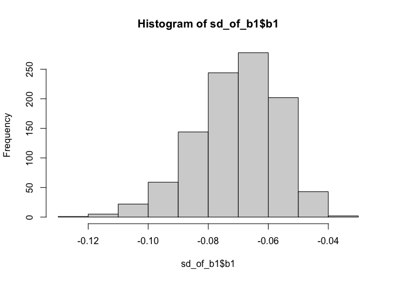
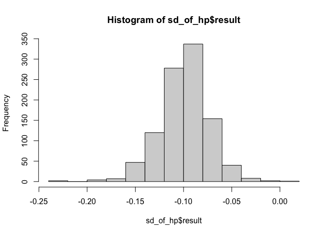

<!-- README.md is generated from README.Rmd. Please edit that file -->

# supernova 

The goal of `supernova` is to create ANOVA tables in the format used by
Judd, McClelland, and Ryan (2017, ISBN: 978-1138819832) in their
introductory textbook, *Data Analysis: A Model Comparison Approach to
Regression, ANOVA, and Beyond* [(book
website)](http://www.dataanalysisbook.com/index.html).\* These tables
include proportional reduction in error, a useful measure for teaching
the underlying concepts of ANOVA and regression, and formatting to ease
the transition between the book and R.

*\* Note: we are NOT affiliated with the authors or their institution.*

In keeping with the approach in Judd, McClelland, and Ryan (2017), the
ANOVA tables in this package are calculated using a model comparison
approach that should be understandable given a beginner’s understanding
of base R and the information from the book (so if you have these and
don’t understand what is going on in the code, let us know because we
are missing the mark\!). Here is an explanation of how the tables are
calculated:

1.  The “Total” row is calculated by updating the model passed to an
    empty model. For example, `lm(mpg ~ hp * disp, data = mtcars)` is
    updated to `(lm(mpg ~ NULL, data = mtcars))`. From this empty model,
    the sum of squares and df can be calculated.

2.  If there is at least one predictor in the model, the overall model
    row and the error row are calculated. In the vernacular of the book,
    the compact model is represented by the updated empty model from 1
    above, and the augmented model is the original model passed to
    `supernova()`. From these models the SSE(A) is calculated by
    `sum(resid(null_model) ^ 2)`, the SSR is calculated by SSE(C) -
    SSE(A), the PRE for the overall model is extracted from the fit
    (`r.squared`), the df for the error row is extracted from the `lm()`
    fit (`df.residuals`).

3.  If there are more than one predictors, the single term deletions are
    computed using `drop1()`. For the model `y ~ a * b` (which expands
    to `y ~ a + b + a:b`, where `a:b` is the interaction of `a` and
    `b`), `drop1()` essentially creates three models each with one term
    removed: `y ~ a + a:b`, `y ~ b + a:b`, and `y ~ a + b`. These models
    are considered the compact models which do not include the tested
    terms `a`, `b`, and `a:b`, respectively. `drop1()` computes the SSR
    (`Sum Sq`) and SSE(C) (`RSS`) for each of these augmented and
    compact model pairs, and these values are used to compute the SSR
    and PRE for each.

4.  Finally, the `MS` (`SS / df`), `F` (`MSR / MSE`), and `p` columns
    are calculated from already-computed values in the table.

In addition to the ANOVA table provided by `supernova()`, the
`supernova` package provides some useful functions for extracting
estimates from a linear model: `b0()`, `b1()`, `fVal()`, `PRE()`. These
are especially useful in the context of creating bootstrapped sampling
distributions as in the [Examples](#examples) below.

### Supported models

The following models are explicitly tested and supported by
`supernova()`, *for independent samples (between-subjects) data only*.
For these models, there is also support for datasets with missing or
unbalanced data.

  - empty models: `y ~ NULL`
  - simple regression: `y ~ a`
  - multiple regression: `y ~ a + b`
  - interactive regression: `y ~ a * b`

Anything not included above is not (yet) explicitly tested and may yield
errors or incorrect statistics. This includes, but is not limited to

  - one-sample *t*-tests
  - dependent samples (within-subjects, repeated measures)

## Installing

You can install the released version of supernova from
[CRAN](https://CRAN.R-project.org) with:

``` r
install.packages("supernova")
```

Alternatively you can download the package directly from this repository
using `devtools`:

``` r
library(devtools)
install_github("UCLATALL/supernova")
```

## Examples

Here are some basic examples of the code and output for this package:

### Testing a model with no predictors (null model)

``` r
supernova(lm(mpg ~ NULL, data = mtcars))
#>  Analysis of Variance Table (Type III SS)
#>  Model: mpg ~ NULL
#>  
#>                                SS  df     MS   F PRE   p
#>  ----- ----------------- -------- --- ------ --- --- ---
#>  Model (error reduced) |      --- ---    --- --- --- ---
#>  Error (from model)    |      --- ---    --- --- --- ---
#>  ----- ----------------- -------- --- ------ --- --- ---
#>  Total (empty model)   | 1126.047  31 36.324
```

### Testing a regression model with a single predictor

``` r
supernova(lm(mpg ~ hp, data = mtcars))
#>  Analysis of Variance Table (Type III SS)
#>  Model: mpg ~ hp
#>  
#>                                SS df      MS      F    PRE     p
#>  ----- ----------------- -------- -- ------- ------ ------ -----
#>  Model (error reduced) |  678.373  1 678.373 45.460 0.6024 .0000
#>  Error (from model)    |  447.674 30  14.922                    
#>  ----- ----------------- -------- -- ------- ------ ------ -----
#>  Total (empty model)   | 1126.047 31  36.324
```

### Multiple regression (Type III SS)

``` r
supernova(lm(mpg ~ hp + disp, data = mtcars))
#>  Analysis of Variance Table (Type III SS)
#>  Model: mpg ~ hp + disp
#>  
#>                                SS df      MS      F    PRE     p
#>  ----- ----------------- -------- -- ------- ------ ------ -----
#>  Model (error reduced) |  842.554  2 421.277 43.095 0.7482 .0000
#>     hp                 |   33.665  1  33.665  3.444 0.1061 .0737
#>   disp                 |  164.181  1 164.181 16.795 0.3667 .0003
#>  Error (from model)    |  283.493 29   9.776                    
#>  ----- ----------------- -------- -- ------- ------ ------ -----
#>  Total (empty model)   | 1126.047 31  36.324
```

### Multiple regression with interaction (Type III SS)

``` r
supernova(lm(mpg ~ hp * disp, data = mtcars))
#>  Analysis of Variance Table (Type III SS)
#>  Model: mpg ~ hp * disp
#>  
#>                                  SS df      MS      F    PRE     p
#>  ------- ----------------- -------- -- ------- ------ ------ -----
#>    Model (error reduced) |  923.189  3 307.730 42.475 0.8198 .0000
#>       hp                 |  113.393  1 113.393 15.651 0.3586 .0005
#>     disp                 |  188.449  1 188.449 26.011 0.4816 .0000
#>  hp:disp                 |   80.635  1  80.635 11.130 0.2844 .0024
#>    Error (from model)    |  202.858 28   7.245                    
#>  ------- ----------------- -------- -- ------- ------ ------ -----
#>    Total (empty model)   | 1126.047 31  36.324
```

### Using Different SS Types

#### Type III: Orthogonal (default)

``` r
supernova(lm(mpg ~ hp * disp, data = mtcars))
#>  Analysis of Variance Table (Type III SS)
#>  Model: mpg ~ hp * disp
#>  
#>                                  SS df      MS      F    PRE     p
#>  ------- ----------------- -------- -- ------- ------ ------ -----
#>    Model (error reduced) |  923.189  3 307.730 42.475 0.8198 .0000
#>       hp                 |  113.393  1 113.393 15.651 0.3586 .0005
#>     disp                 |  188.449  1 188.449 26.011 0.4816 .0000
#>  hp:disp                 |   80.635  1  80.635 11.130 0.2844 .0024
#>    Error (from model)    |  202.858 28   7.245                    
#>  ------- ----------------- -------- -- ------- ------ ------ -----
#>    Total (empty model)   | 1126.047 31  36.324
```

These are equivalent to the above:

``` r
supernova(lm(mpg ~ hp * disp, data = mtcars), type = 3)
supernova(lm(mpg ~ hp * disp, data = mtcars), type = "III")
supernova(lm(mpg ~ hp * disp, data = mtcars), type = "orthogonal")
```

#### Type I: Sequential

``` r
supernova(lm(mpg ~ hp * disp, data = mtcars), type = 1)
#>  Analysis of Variance Table (Type I SS)
#>  Model: mpg ~ hp * disp
#>  
#>                                  SS df      MS      F    PRE     p
#>  ------- ----------------- -------- -- ------- ------ ------ -----
#>    Model (error reduced) |  923.189  3 307.730 42.475 0.8198 .0000
#>       hp                 |  678.373  1 678.373 93.634 0.7698 .0000
#>     disp                 |  164.181  1 164.181 22.661 0.4473 .0001
#>  hp:disp                 |   80.635  1  80.635 11.130 0.2844 .0024
#>    Error (from model)    |  202.858 28   7.245                    
#>  ------- ----------------- -------- -- ------- ------ ------ -----
#>    Total (empty model)   | 1126.047 31  36.324
```

These are equivalent to the above:

``` r
supernova(lm(mpg ~ hp * disp, data = mtcars), type = "I")
supernova(lm(mpg ~ hp * disp, data = mtcars), type = "sequential")
```

#### Type II: Hierarchical

``` r
supernova(lm(mpg ~ hp * disp, data = mtcars), type = 2)
#>  Analysis of Variance Table (Type II SS)
#>  Model: mpg ~ hp * disp
#>  
#>                                  SS df      MS      F    PRE     p
#>  ------- ----------------- -------- -- ------- ------ ------ -----
#>    Model (error reduced) |  923.189  3 307.730 42.475 0.8198 .0000
#>       hp                 |   33.665  1  33.665  4.647 0.1423 .0399
#>     disp                 |  164.181  1 164.181 22.661 0.4473 .0001
#>  hp:disp                 |   80.635  1  80.635 11.130 0.2844 .0024
#>    Error (from model)    |  202.858 28   7.245                    
#>  ------- ----------------- -------- -- ------- ------ ------ -----
#>    Total (empty model)   | 1126.047 31  36.324
```

These are equivalent to the above:

``` r
supernova(lm(mpg ~ hp * disp, data = mtcars), type = "II")
supernova(lm(mpg ~ hp * disp, data = mtcars), type = "hierarchical")
```

### Displaying which models were compared

This package is based on a model comparison approach to understanding
regression and ANOVA. As such it is useful to know which models are
being compared for any given term in an ANOVA table. The
`generate_models()` function accepts a linear model and the desired type
of SS and returns a list of the models that should be compared to
appropriately evaluate each term in the full model.

``` r
generate_models(lm(mpg ~ hp * disp, data = mtcars), type = 2)
#> Comparison Models for Type II SS
#> Model: mpg ~ hp * disp
#> 
#> Full Model
#>   complex: mpg ~ hp + disp + hp:disp
#>    simple: mpg ~ NULL
#> hp
#>   complex: mpg ~ hp + disp
#>    simple: mpg ~      disp
#> disp
#>   complex: mpg ~ hp + disp
#>    simple: mpg ~ hp
#> hp:disp
#>   complex: mpg ~ hp + disp + hp:disp
#>    simple: mpg ~ hp + disp
```

### Bootstrapping Estimates

The estimate extraction functions in the package simplify the ability to
create bootstrapped sampling distributions of those estimates. The
functions currently exported are `PRE`, `b0`, `b1`, `fVal`, `SSM`/`SSR`,
and `SSE`. Other terms can be bootstrapped as well, the target estimated
just needs to be extracted via other means.

#### Bootstrapping the slope of a simple model

``` r
# to extract a single estimate:
b1(lm(mpg ~ hp, data = mtcars))
#> [1] -0.06823

# use mosaic package to repetetively resample to bootstrap a distribution
sd_of_b1 <- mosaic::do(1000) * b1(lm(mpg ~ hp, data = mosaic::resample(mtcars)))

# plot the bootstrapped estimates
hist(sd_of_b1$b1)
```



#### Bootstrapping the effect of one term from a multiple regression

``` r
sd_of_hp <- mosaic::do(1000) * {
  # create a new model from the resampled data
  model <- lm(mpg ~ disp * hp, data = mosaic::resample(mtcars))
  
  # extract the desired estimate, here the coefficient for hp
  coef(model)[["hp"]]
}

# plot the bootstrapped estimates
hist(sd_of_hp$result)
```



# Contributing

If you see an issue, problem, or improvement that you think we should
know about, or you think would fit with this package, please let us know
on our [issues page](https://github.com/UCLATALL/supernova/issues).
Alternatively, if you are up for a little coding of your own, submit a
pull request:

1.  Fork it\!
2.  Create your feature branch: `git checkout -b my-new-feature`
3.  Commit your changes: `git commit -am 'Add some feature'`
4.  Push to the branch: `git push origin my-new-feature`
5.  Submit a [pull request](https://github.com/UCLATALL/supernova/pulls)
    :D
